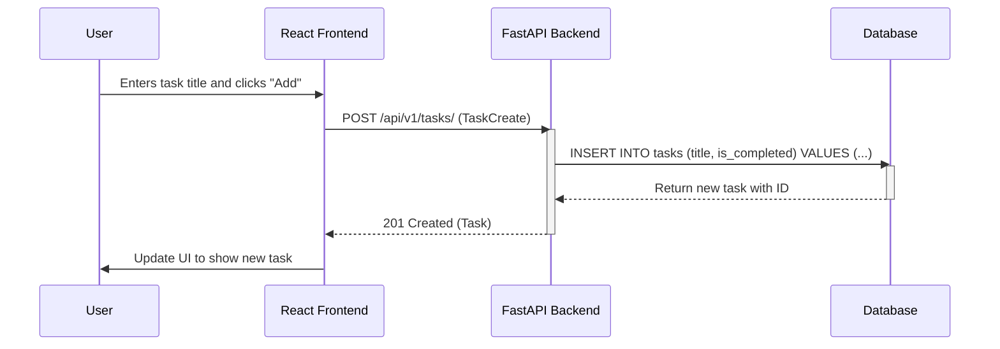
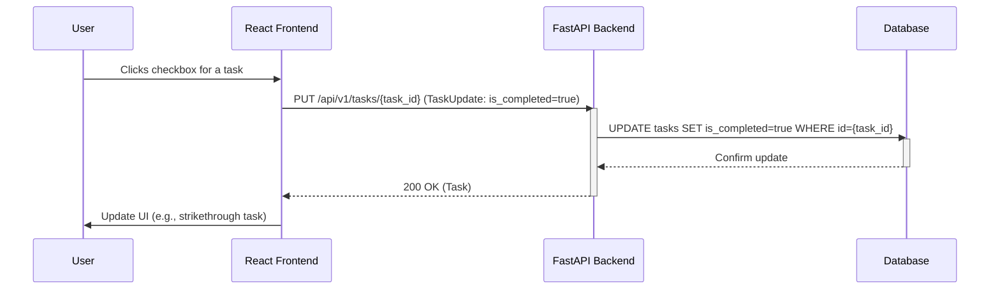
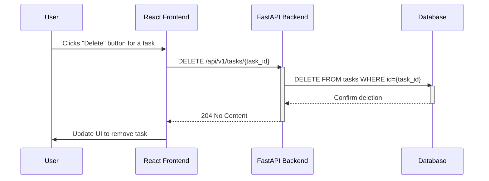

# UML Sequence Diagrams for To-Do List App

This document contains UML sequence diagrams for key user interactions in the To-Do List application. The diagrams are represented using Mermaid syntax.

## 1. Adding a Task

This diagram shows the sequence of events when a user adds a new task to their list.

## 2. Marking a Task as Complete

This diagram illustrates how a task's completion status is updated.

## 3. Deleting a Task

This diagram shows the sequence for deleting a task from the list.

